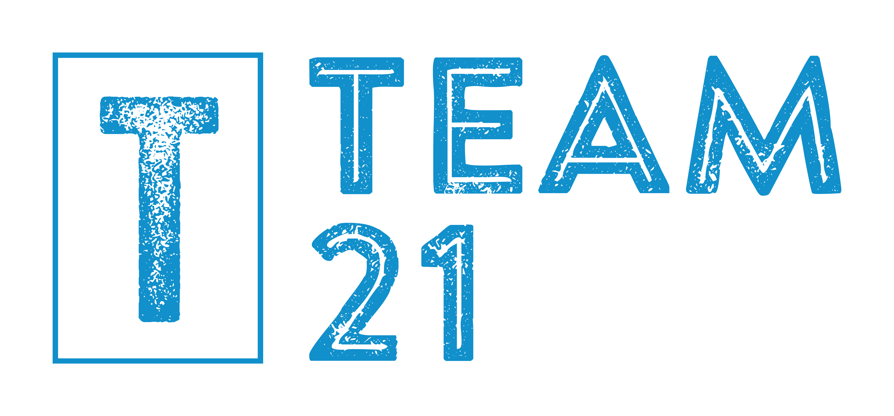

<div id="top"></div>

<!-- lil picture-->
<div align="center">


# Team 21 - Haptic Collaborative Games
</div>

### Contributors: 
Salaar Mir - Team Leader & Developer  
Daniel Lambert - Team Administrator & Developer  
Tianfeng Chen - Git Master & Developer  
Lok Lam - Developer  
Ibrahim Atomanson - Developer  
Jiahao Wang - Developer  

___


This repository contains our group project work where we created logical software architecture that allows for modular development of physical haptic games using the chai3d framework. 

## Some background
[CHAI3D](https://www.chai3d.org/ "chai3d Website") is an open source powerful cross-platform C++ simulation framework designed for computer haptics, visualisation and interactive real-time simulation. The framework supports a variety of commercially-available three-, six- and seven-degree-of-freedom haptic devices, and makes it simple to support new custom force feedback devices. ([chai3d documentation](https://www.chai3d.org/documentation/getting-started "chai3d Website"))

<!-- probably needs editing and adding to--> 
Our software architecture builds on the framework to make building a haptic game easier. 

We built a simple game example using our architecture to show its capabilities.

<p align="right">(<a href="#top">return to top</a>)</p>

# Repository Contents
* [CHAI3D framework](/chai3d-3.2.0/)
* [Our Board Game Architecture](/BoardGameArchitecture/src)
* [Our documentation of code](/Documentation)
* [CHAI3D modified for device usage](/chai3d/)

# Getting started
## Minimum requirements
* A Haptic Force-Feedback capable device<sup>[1]</sup>
* A machine capable of running Ubuntu xx.xx with a stable connection to the device.
<!-- GO FIND WHAT UBUNTU VERSION THE MACHINE IS USING-->
[1] Our repository is only tested with the Haption Virtuose 6D device and its associated equipment in the Cobot Maker Space at the University of Nottingham

<p align="right">(<a href="#top">return to top</a>)</p>

## Installation

Please begin by running this command to update:
```sh
sudo apt update
```

### --- Fresh OS installation prerequisites --- 
Install Git, Make and g++:
```bash
sudo apt install Git
sudo apt install build-essential
```
(Make and g++ are included in build-essential)


The following packages are required by chai3d:

`libusb-1.0` development package:
```bash
sudo apt-get install libusb-1.0-0-dev
```

`ALSA` (Advanced Linux Sound Architecture) development package
```bash
sudo apt-get install libasound2-dev
```

`FreeGLUT` development package
```bash
sudo apt-get install freeglut3-dev
```

The following are also required from the xorg-dev package:

`libxcursor-dev`

`libxrandr-dev`

`libxinerama-dev`

Acquire these individually or all at once:
```bash
sudo apt install xorg-dev
```
<p align="right">(<a href="#top">return to top</a>)</p>

## Building the project
1. Clone the project in a terminal using git:
```bash
git clone https://projects.cs.nott.ac.uk/comp2002/2021-2022/team21_project.git
```
2. Navigate to the example directory:
```bash
cd team21_project/BoardGameArchitecture/haptic\ games/maze
```
3. Build the project using make:
```bash
make output
```
4. (Optional) Run the pre-made example:
```bash
cd ../../bin
./mazeGame
```

<p align="right">(<a href="#top">return to top</a>)</p>

___

## Creating a game
Please see our [full code documentation](/Documentation) to learn how to create a game using our architecture.

___

<p align="center">(<a href="#top">return to top</a>)</p>
